# Active Directory Security Home Lab

## Overview

This project demonstrates the deployment, administration, and security analysis of a Windows Server 2022 Active Directory environment in a virtualized lab.

The lab was built to gain practical experience with:

* Active Directory Administration
* Domain Controller Deployment
* DNS Configuration
* User & Group Management
* Organizational Units (OUs)
* Domain Joining
* LDAP Enumeration
* SMB Enumeration
* Network Enumeration
* BloodHound Analysis
* Active Directory Security Fundamentals

---

# Lab Architecture

```text
                    +---------------------+
                    |     Kali Linux      |
                    |  Attacker Machine   |
                    +----------+----------+
                               |
                               |
---------------------------------------------------------
                               |
                               |
                    +----------+----------+
                    |        DC01         |
                    | Windows Server 2022 |
                    | Domain Controller   |
                    |     corp.local      |
                    +----------+----------+
                               |
                               |
                    +----------+----------+
                    |      WIN11-01       |
                    | Windows 11 Client   |
                    | Domain Joined Host  |
                    +---------------------+
```

---

# Lab Environment

| Component         | Description       |
| ----------------- | ----------------- |
| Hypervisor        | Oracle VirtualBox |
| Domain Name       | corp.local        |
| Domain Controller | DC01              |
| DNS Server        | DC01              |
| Client Machine    | WIN11-01          |
| Attacker Machine  | Kali Linux        |

---

# Virtual Machines

## DC01

* Windows Server 2022
* Active Directory Domain Services (AD DS)
* DNS Server
* Domain Controller

## WIN11-01

* Windows 11
* Domain Joined Workstation

## Kali Linux

Installed Tools:

* BloodHound CE
* BloodHound Python
* Neo4j
* Nmap
* Enum4Linux
* SMBClient
* LDAP Enumeration Tools

---

# Active Directory Structure

## Organizational Units (OUs)

* HR
* Finance
* IT
* Sales
* Marketing
* Service Accounts
* Groups
* Servers
* Workstations

---

## Security Groups

* HR_Users
* Finance_Users
* IT_Users
* Sales_Users
* Marketing_Users
* Workstation Admins
* Server Admins

---

## Example Users

* sarah.hr
* ali.finance
* ahmed.it
* hamza.sales
* zara.marketing

---

## Service Accounts

* svc_sql
* svc_backup
* svc_monitor

---

# Active Directory Deployment

## Domain Controller Setup

Completed:

* Installed Windows Server 2022
* Configured Static IP Address
* Installed AD DS Role
* Promoted Server to Domain Controller
* Created corp.local Domain

---

## DNS Configuration

Configured:

* Forward Lookup Zone
* DNS Name Resolution
* LDAP Service Records

---

## Client Deployment

* Installed Windows 11
* Joined workstation to corp.local
* Verified domain authentication

---

# Enumeration Activities

## DNS Enumeration

```bash
nslookup corp.local 192.168.100.10
```

## LDAP Enumeration

```bash
nslookup -type=SRV _ldap._tcp.dc._msdcs.corp.local 192.168.100.10
```

## Network Scanning

```bash
nmap -sV -p 53,88,135,139,389,445,464,636,3268,3269 192.168.100.10
```

## SMB Enumeration

```bash
smbclient -L //192.168.100.10 -N
```

## Domain Enumeration

```bash
enum4linux 192.168.100.10
```

---

# BloodHound Analysis

BloodHound was used to collect and analyze Active Directory relationships.

## Data Collection

```bash
bloodhound-python \
-d corp.local \
-u USERNAME \
-p PASSWORD \
-ns 192.168.100.10 \
-c All
```

## Analysis Objectives

* User Enumeration
* Group Enumeration
* Computer Enumeration
* Domain Mapping
* Privilege Analysis
* Attack Path Discovery
* Administrative Relationship Analysis

---

# Screenshots

## Infrastructure

### VirtualBox Lab Environment

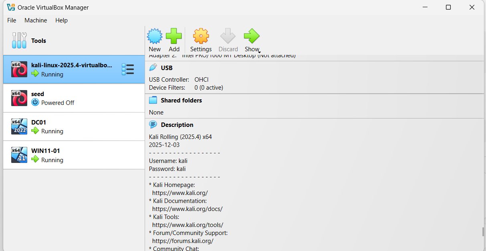

### Active Directory Overview

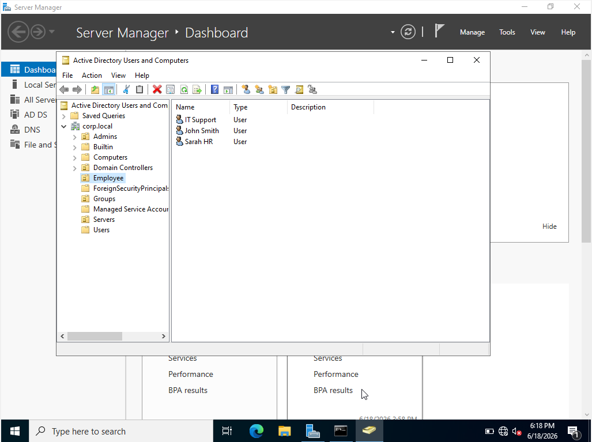

---

## Active Directory Administration

### Organizational Units Structure

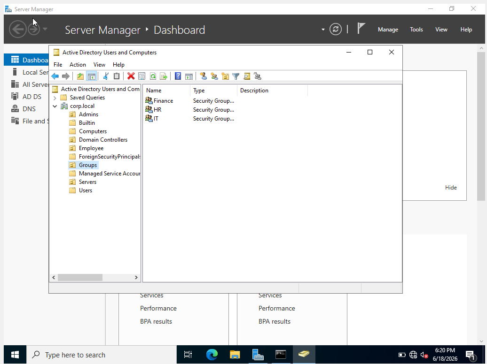

### Users

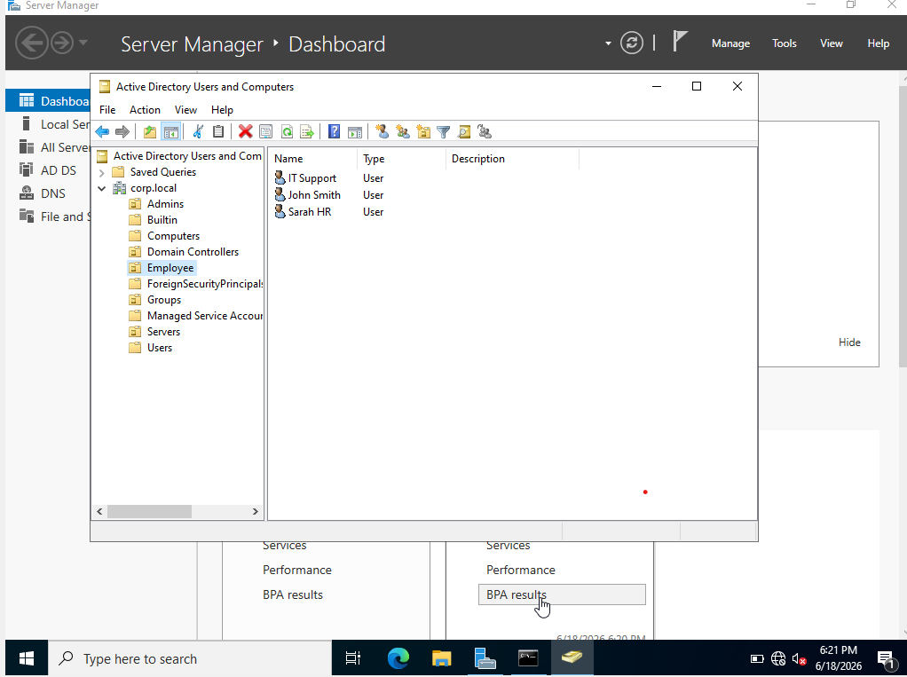

### Groups

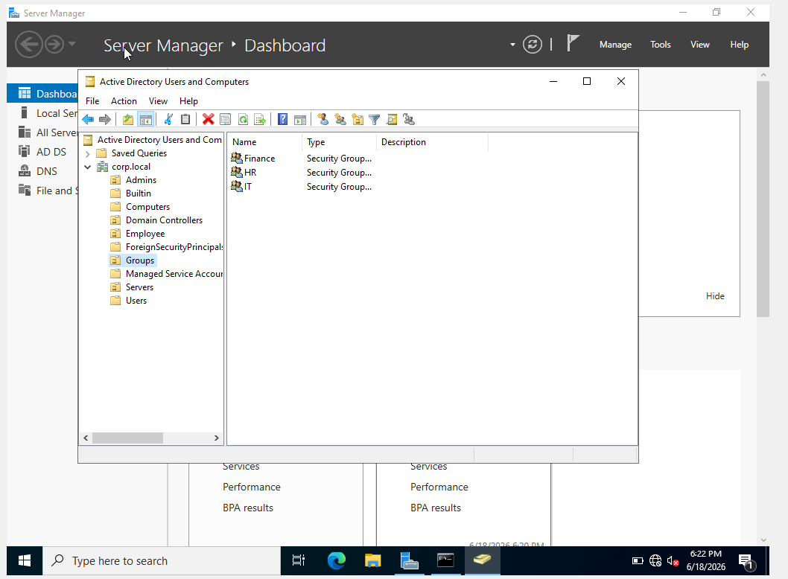

### DNS Configuration

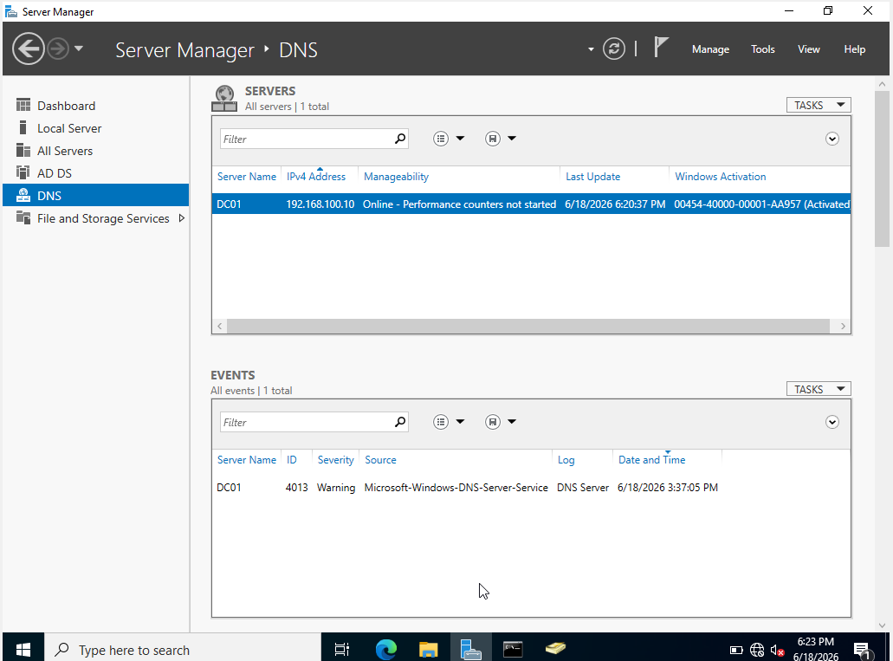

### Domain Join

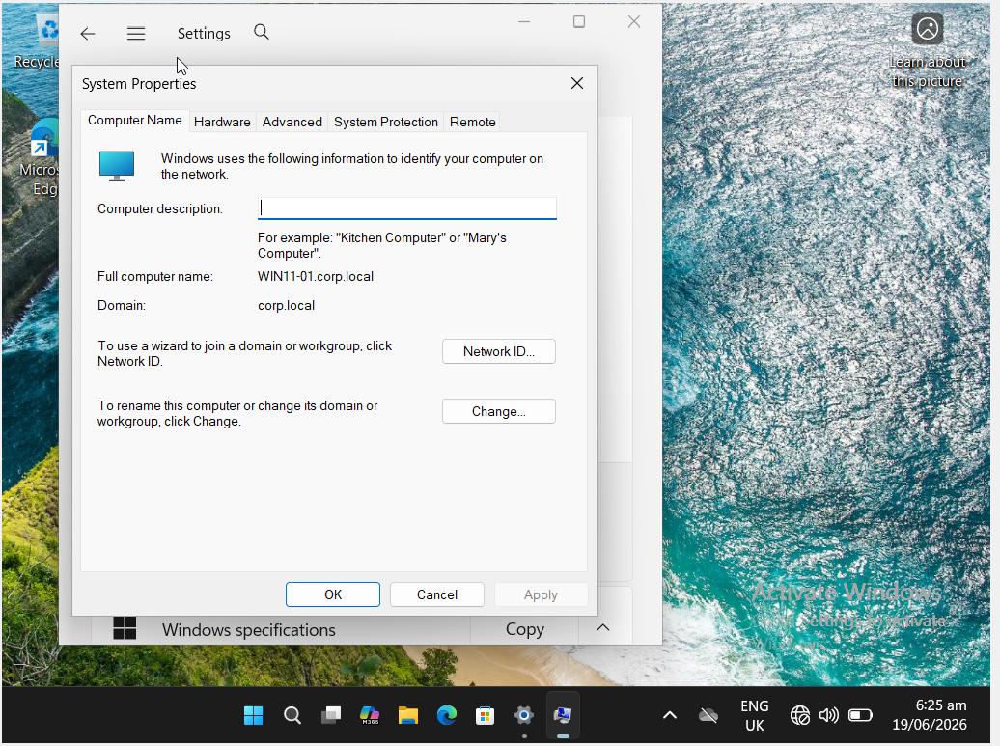

---

## Enumeration

### Nmap Scan

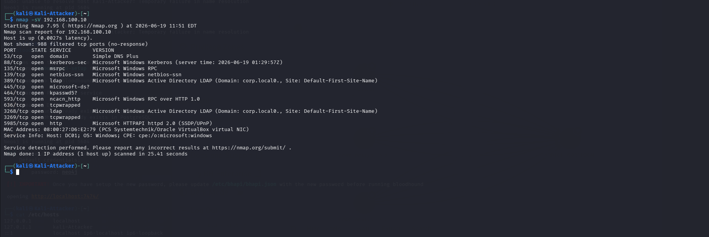

### DNS Enumeration

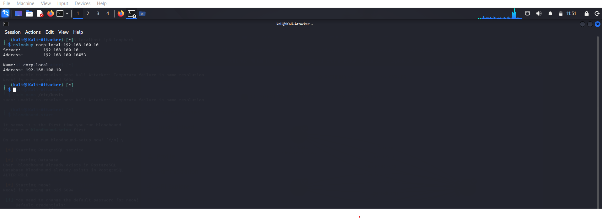

### LDAP Enumeration

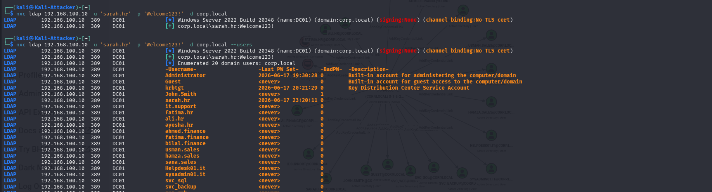

### Additional LDAP Enumeration

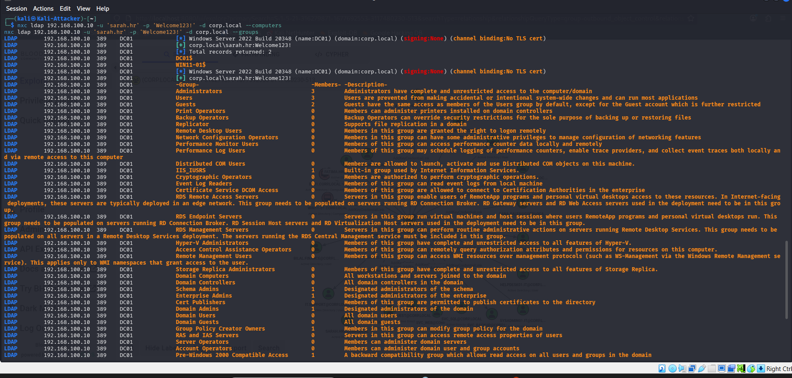

### SMB Enumeration

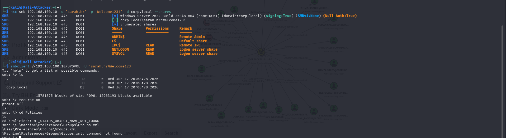

### User and Group Enumeration

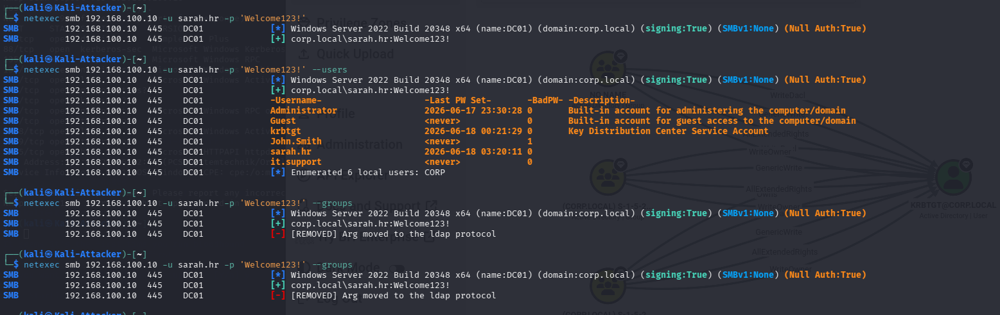

---

## BloodHound Analysis

### BloodHound Dashboard

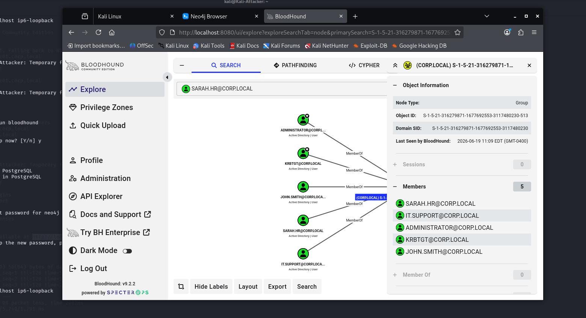

### BloodHound Graph

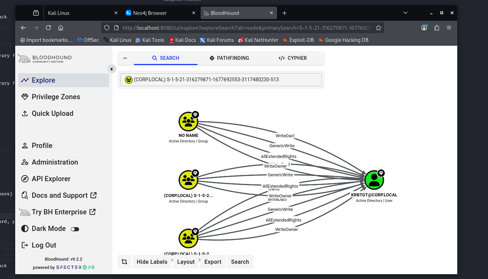

---

# Skills Demonstrated

## Active Directory

* Active Directory Administration
* User Management
* Group Management
* Organizational Unit Administration
* DNS Administration
* Domain Management

## Security

* LDAP Enumeration
* SMB Enumeration
* DNS Enumeration
* Network Enumeration
* BloodHound Analysis
* Attack Surface Mapping

## Windows Administration

* Windows Server Deployment
* Domain Controller Configuration
* Domain Joining
* Account Management

---

# Learning Outcomes

Through this project I gained practical experience in:

* Building an Active Directory environment from scratch
* Configuring Domain Controllers
* Managing users, groups, and permissions
* Performing Active Directory enumeration
* Understanding Kerberos, LDAP, SMB, and DNS
* Using BloodHound to visualize AD relationships
* Identifying potential privilege escalation paths

---

# Future Enhancements

Planned additions include:

* Group Policy Objects (GPOs)
* Additional Domain Controllers
* File Server Deployment
* Kerberoasting Lab
* AS-REP Roasting Lab
* Password Spraying Lab
* Privilege Escalation Scenarios
* Full Active Directory Red Team Lab

---

# Author

**Umar Farooq**

Cybersecurity Student | Active Directory Security | SOC Analyst | Red Teaming

GitHub: https://github.com/Umar-FarooQ1427

TryHackMe: https://tryhackme.com/p/umarfarooq1427
